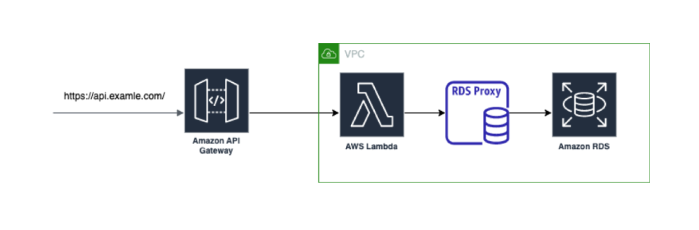

This repository holds a following example - Django application deployed on AWS Lambda with connection to 
AWS RDS PostgreSQL database.

How to get it running:
1. Make sure you've got `Serverless Framework` installed on your machine you can get it via npm:
`npm install -g serverless`. 
More information you can find here: https://www.serverless.com/framework/docs/getting-started
2. Get extra npm packages containing plugins that help get running Django WSGI server with Serverless Framework
`npm install --save-dev serverless-wsgi serverless-python-requirements`
3. Create files `secrets.json` and `.env` and supply them with environment variables. You can find example files in 
repository (they are called `secrets_example.json` and `.env.example`)
4. Before deployment to AWS make sure you've got installed and configurated AWS CLI. You can find more information here:
https://aws.amazon.com/cli/
5. Finally you are able to deploy application into AWS simply by running command `sls deploy`. If you would like to get
it running on your localhost execute `sls wsgi serve`.

Executing Django commands remotely:
1. For running Django migrations into the database execute: `sls wsgi manage –command ‘migrate’`
2. If you would like to create superuser account you can use django_createsuperuserwithpassword 
(https://github.com/hartwork/django-createsuperuserwithpassword) and then run it by command:
`sls wsgi manage --command "createsuperuserwithpassword --username admin --password admin --email admin@example.org 
--preserve”`
